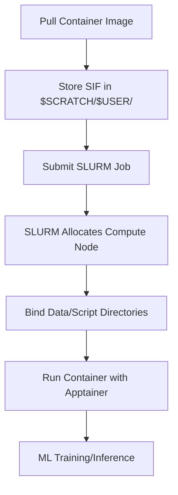
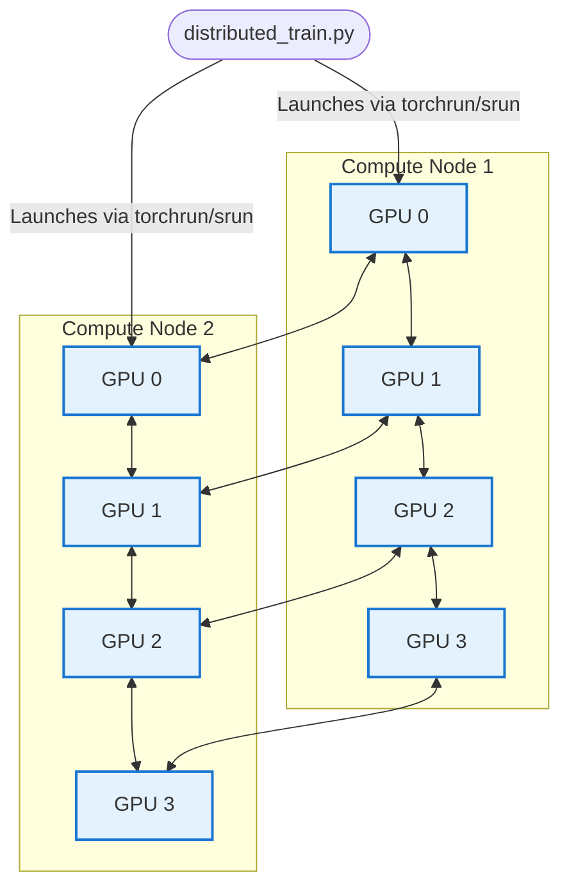

# Applied Containerization for Machine Learning

## A Hands-on Guide to Running ML Workloads in HPC Environments

<div style="text-align: center;">
  
</div>

<span class="affil">
RCC Workshop Series<br>
Summer 2025<br>
Parmanand Sinha, <br>
Computational Scientist (GIS+HPC)<br>
University of Chicago Research Computing Center
</span>

---

## Workshop Overview

- **Duration**: 2 hours (1 hour presentation, 1 hour hands-on)
- **Level**: Intermediate
- **Prerequisites**:
  - Basic programming knowledge
  - Linux CLI familiarity
  - Active RCC/cluster account
- **Repository**: [GitHub](https://github.com/rcc-uchicago/hpc-ml-containers-workshop)

---
<!-- class: divider -->
# 1. Introduction to Containerization in HPC
---
<!-- class: default -->

### Why Containers for ML in HPC?

- **Dependency Management**:
  - Package complex ML software stacks with all dependencies (Python, CUDA, MPI, etc.).
  - Resolve version conflicts and avoid "dependency hell."

- **Portability**:
  - Run the same containerized environment on any cluster, cloud, or laptop.
  - "Build once, run anywhere" across diverse HPC systems.

- **Security & Isolation**:
  - Restrict software to a controlled environment, reducing risk to the host system.
  - Run untrusted or experimental code safely.

- **Collaboration**:
  - Share containers with colleagues for consistent results.
  - Simplifies onboarding and reproducibility in research teams.

---

### Why Containers for ML in HPC? (Cont.)

- **Reproducibility**:
  - Capture the exact software environment for consistent, repeatable results.
  - Essential for scientific research and peer review.

- **Performance**:
  - Near-native speed with minimal overhead; direct access to GPUs and high-speed interconnects.
  - Optimized images can boost job throughput and resource utilization.

- **Scalability**:
  - Easily scale workloads from a laptop to thousands of nodes.
  - Integrate seamlessly with schedulers like SLURM for large ML jobs.

---

> [!callout]
> **Summary: Why Containers?**
>
> - Solve dependency and environment headaches
> - Speed up onboarding and collaboration
> - Achieve reproducible, portable, and secure ML workflows
> - Unlock scalable, high-performance computing for modern research

---

### Container Basics: What is a Container?

- An isolated, encapsulated user-space instance.
- Runs on a shared OS kernel but has its own:
  - Filesystem
  - Processes
  - Network interfaces (can be configured)
- Lightweight compared to Virtual Machines (VMs) as they don't require a full guest OS.

---

### Containers vs Virtual Machines (VMs)

| Aspect         | Virtual Machine (VM)              | Container                      |
|----------------|----------------------------------|-------------------------------|
| **Isolation**  | Full (hardware/emulated)         | Process/user-space             |
| **Guest OS**   | Full OS per VM                   | Shares host OS kernel          |
| **Startup**    | Slow (minutes)                   | Fast (seconds)                 |
| **Resource Use** | Heavy (more RAM/CPU)           | Lightweight (minimal overhead) |
| **Portability**| Hypervisor-dependent             | "Build once, run anywhere"     |
| **Use Case**   | Legacy apps, OS-level isolation  | ML, microservices, HPC, CI/CD  |

<div style="text-align: center;">
  
  <div style="font-size: 0.8em; color: #888; margin-top: 0.5em;">Image source: apptainer.org</div>
</div>

**Key Takeaways:**
- Containers are much faster to launch and use fewer resources.
- Ideal for reproducible, scalable ML and HPC workflows.
- VMs provide stronger isolation but are heavier and slower.


---

### Container Basics: Key Components

- **Container Images**:
  - Read-only templates used to create containers.
  - Contain application code, libraries, dependencies, and metadata.
  - Examples: Docker Hub images, SIF files (Apptainer).

- **Runtime Environments**:
  - Software that runs containers (e.g., Apptainer, Docker, Charliecloud).
  - Manages container lifecycle, isolation, and resource allocation.

---

### Containerization Workflow in HPC

<!-- class: default -->

<div style="text-align: center">



</div>

---

### Container Basics: Key Components (Cont.)

- **Mount Points for Data (Bind Mounts)**:
  - Mechanism to make host directories/files accessible inside the container.
  - Essential for accessing datasets, scripts, and output directories.

- **Resource Allocation**:
  - Containers share host resources (CPU, memory, GPUs).
  - HPC schedulers (like SLURM) manage resource allocation for containerized jobs.

--- 
<!-- class: divider -->
# 2. Apptainer (formerly Singularity) Introduction
---
<!-- class: default -->

### Apptainer & Singularity: A Quick Note

- **Apptainer** is the direct successor to **Singularity**.
- You might see `singularity` used in older documentation or as the module name on some HPC systems.  
- Commands are largely interchangeable (e.g., `singularity pull` vs. `apptainer pull`).
- This workshop uses modern `apptainer` commands.

---

## Hands-on with Apptainer (Introduction)

*(This section introduces Apptainer. The actual hands-on will follow in the next hour.)*

---

### Apptainer: Getting Started

```bash
# Load Apptainer module (on HPC systems)
module load apptainer

# Pull a PyTorch container image from Docker Hub
apptainer pull docker://pytorch/pytorch:latest
# This creates a .sif file (e.g., pytorch_latest.sif)
```
- **SIF (Singularity Image Format)**: Apptainer's default, optimized image format.
- **Storage Tip**: For large images, consider pulling/storing them in your scratch directory. 
  - On Midway3: `$SCRATCH/$USER/sif_files/` (where `$SCRATCH` is `/scratch/midway3`).
  - Check your system's recommended scratch location.

---

### Apptainer: Basic Commands

- **Interactive Shell**:
  ```bash
  # Start an interactive shell inside the container
  # --nv enables NVIDIA GPU access
  apptainer shell --nv pytorch_latest.sif
  ```

- **Run a Python Script**:
  ```bash
  # Execute a command (e.g., a Python script) inside the container
  apptainer exec --nv pytorch_latest.sif python my_script.py
  ```

---

### Apptainer: Basic Commands (Cont.)

- **Bind Data Directories**:
  ```bash
  # Run a container and mount /data on host to /data in container
  apptainer run --nv --bind /path/on/host:/path/in/container pytorch_latest.sif
  
  # Example: Mount current working directory ($PWD) to /mnt inside container
  apptainer run --nv --bind $PWD:/mnt pytorch_latest.sif
  ```
  - `apptainer run` executes the default runscript defined in the image (if any).
  - Binding `$PWD` (current working directory) is very useful for accessing your scripts and local data within the container.

---

### Apptainer: Key Features

- **GPU Support**: `--nv` flag for seamless NVIDIA GPU access.
- **Data Binding**: Mount host directories inside the container (`--bind` or `-B`).
  - Crucial for accessing datasets and saving results.
- **Environment Variables**: Pass configuration through the container boundary.
  - Apptainer typically inherits host environment; can be controlled.
- **MPI Support**: Run distributed workloads across nodes.
  - Often requires MPI compatibility between host and container.

---
<!-- class: divider -->
# 3. Charliecloud Overview
---
<!-- class: default -->

### Charliecloud vs. Apptainer

| Feature          | Apptainer (formerly Singularity) | Charliecloud                 |
|------------------|-----------------------------------|------------------------------|
| Security Model   | set-UID (optional), rootless execution | Fully unprivileged (user namespaces) |
| Image Format     | SIF (optimized, single file)    | Directory trees, SquashFS    |
| Build Process    | `.def` files, build from Docker Hub | Direct Dockerfile support    |
| Best Use Case    | Complex ML workflows, ease of use | Security-critical environments, Docker familiarity |

---

### Charliecloud: Key Benefits

- **Minimal Attack Surface**: 
  - Fully unprivileged operation using user namespaces.
  - Reduces security risks on shared HPC systems.
- **Docker Compatibility**:
  - Direct use of Dockerfiles for building images (`ch-convert`).
  - Easier transition for users familiar with Docker.
- **Lightweight & Simple**:
  - Simpler architecture and deployment compared to some other runtimes.
  - Focuses on core containerization features.

---
<!-- class: divider -->
# 4. Practical ML Container Deployment (Examples)
---
<!-- class: default -->

### TensorFlow Example with Apptainer

```bash
# 1. Pull TensorFlow container (GPU version)
apptainer pull docker://tensorflow/tensorflow:latest-gpu

# 2. Run training script
# Assumes train.py and data are accessible via bind mounts
apptainer exec --nv tensorflow_latest-gpu.sif \
  python /path/to/your/train.py --data /path/to/data
```
- `--nv`: Enables NVIDIA GPU access.
- Bind mount your script directory and dataset directory.

---

### PyTorch Example with Apptainer (Multi-GPU)

```bash
# Pull PyTorch container (if not already done)
# apptainer pull docker://pytorch/pytorch:latest

# Multi-GPU training using torchrun (formerly torch.distributed.launch)
apptainer exec --nv pytorch_latest.sif \
  torchrun --nproc_per_node=4 /path/to/your/distributed_train.py
```
- Assumes `distributed_train.py` is set up for PyTorch DDP.
- `--nproc_per_node` should match available GPUs.

---

### Distributed Training Topology (Multi-Node/Multi-GPU)

<!-- class: default -->

<div style="text-align: center">



</div>

---

<!-- class: divider -->
# 5. SLURM Integration (Brief Overview)
---

<!-- class: default -->

### SLURM Job Lifecycle

<div style="text-align: center">

```mermaid
flowchart TD
    A[User Submits sbatch/srun] --> B[SLURM Scheduler]
    B --> C[Resources Allocated (Nodes/GPUs)]
    C --> D[Job Starts on Compute Node(s)]
    D --> E[Container Launched (Apptainer)]
    E --> F[ML Script Executes]
    F --> G[Job Output Written]
    G --> H[Job Completes]
```

</div>

---

### SLURM: Single-Node Job Example

```bash
#!/bin/bash
#SBATCH --job-name=ml-training
#SBATCH --gres=gpu:1          # Request 1 GPU
#SBATCH --partition=gpu       # Specify GPU partition
#SBATCH --cpus-per-task=4     # Request 4 CPUs
#SBATCH --mem=16G             # Request 16GB RAM

# Load Apptainer module
module load apptainer

# Define paths (replace with your actual paths)
CONTAINER_IMAGE=/path/to/pytorch_latest.sif
SCRIPT_DIR=/path/to/your/scripts
DATA_DIR=/path/to/your/data
OUTPUT_DIR=/path/to/your/output

# Ensure output directory exists
mkdir -p $OUTPUT_DIR

# Run the containerized job
apptainer run --nv \
  --bind $SCRIPT_DIR:/scripts \
  --bind $DATA_DIR:/data \
  --bind $OUTPUT_DIR:/output \
  $CONTAINER_IMAGE python /scripts/train.py --data_dir /data --output_dir /output
```

---

### SLURM: Multi-Node Distributed Training Example

```bash
#!/bin/bash
#SBATCH --job-name=dist-ml-train
#SBATCH --nodes=2                # Request 2 nodes
#SBATCH --ntasks-per-node=4      # 4 tasks (processes) per node
#SBATCH --gres=gpu:4             # 4 GPUs per node (total 8 GPUs)
#SBATCH --cpus-per-task=2        # 2 CPUs per task
#SBATCH --partition=gpu-multi    # Example partition for multi-node GPU jobs

module load apptainer

CONTAINER_IMAGE=/path/to/your/ml_container.sif
# Script should handle distributed setup (e.g., using torchrun environment variables)

# srun will launch 'ntasks-per-node' copies of this command on each node
srun apptainer run --nv \
  --bind /path/to/data:/data \
  $CONTAINER_IMAGE \
  torchrun --nnodes=$SLURM_NNODES \
           --nproc_per_node=$SLURM_NTASKS_PER_NODE \
           --rdzv_id=$SLURM_JOB_ID \
           --rdzv_backend=c10d \
           --rdzv_endpoint=$SLURM_STEP_NODELIST:29500 \
           /path/to/your/distributed_train.py
```
*Note: `rdzv_endpoint` might need the head node's IP/hostname explicitly.* 

---
<!-- class: divider -->
# 6. Best Practices
---
<!-- class: default -->

### Best Practices: Container Management

- **Version Control & Tagging**:
  - Tag containers with specific versions (e.g., `myimage:1.0.0`, `myimage:latest-cuda11.8`).
  - Store definition files (`.def`, Dockerfiles) in version control (Git).
- **Data Management**:
  - Use bind mounts for large datasets to avoid including them in images.
  - Keep images small and focused on software environment.
- **Resource Allocation**:
  - Match container resource needs to SLURM (or other scheduler) requests.
  - Avoid over-subscribing resources.

---

### Best Practices: Performance Optimization

- **GPU Access**: Always use `--nv` (Apptainer) or equivalent for GPU workloads.
- **I/O Optimization**:
  - Bind fast storage for temporary files. On Midway3, compute nodes often have a high-throughput SSD directory at `$TEMP` (e.g., `/scratch/local/$USER/`) ideal for this.
  - For frequently accessed small files or datasets, consider staging them to such temporary storage.
  - Be mindful of I/O patterns within the container.
- **MPI Configuration**:
  - For multi-node MPI jobs, ensure compatibility between container MPI and host MPI (Hybrid model or Bind model).
  - Consult HPC center documentation for recommended MPI practices with containers.

---

### Best Practices: Security Considerations

- **Unprivileged Execution**:
  - Run containers without root access whenever possible.
  - Apptainer runs as user by default. Charliecloud is designed for unprivileged execution.
- **Data Protection**:
  - Use appropriate bind mounts; be specific about what host paths are exposed.
  - Avoid overly broad mounts (e.g., binding `/`).
- **Resource Limits**:
  - Rely on the HPC scheduler (SLURM) to enforce resource limits (CPU, memory, GPU).
  - Containers operate within the cgroups/namespaces set by the scheduler.


---
<!-- class: divider -->

# 7. Additional Resources
---
<!-- class: default -->

### Resources: Documentation

- **Apptainer Official Documentation:**  
  [https://apptainer.org/docs/](https://apptainer.org/docs/)
  <div style="text-align: center;">
    
  </div>
  <br>
- **Charliecloud User Guide:**  
  [https://hpc.github.io/charliecloud/](https://hpc.github.io/charliecloud/)
  <div style="text-align: center;">
    
  </div>
  <br>
- **Workshop Repository:**  
  (Contains this presentation, examples, and hands-on materials)
  <div style="text-align: center;">
    
  </div>
  <br>

  
</div>
  (Contains this presentation, examples, and hands-on materials)

---

### Resources: Example Repositories & Further Learning

- **ML Framework Containers (Official Hubs):**
  - Docker Hub: [https://hub.docker.com/](https://hub.docker.com/)  
    <div style="text-align: center;">
      
    </div>
    (e.g., `pytorch/pytorch`, `tensorflow/tensorflow`)
  - NVIDIA NGC: [https://ngc.nvidia.com/](https://ngc.nvidia.com/)  
    <div style="text-align: center;">
      
    </div>
- **SLURM Integration Scripts:** Check your HPC center's documentation for specific examples.

- **Further Learning Topics:**
  - Advanced container building (multi-stage builds, custom base images)
  - Creating custom ML environments from scratch
  - Advanced distributed training patterns (e.g., with Horovod, DeepSpeed)
  - Performance optimization and profiling for containerized applications
  - Pulling images from private registries (e.g., NVIDIA NGC) using authentication
  - Running interactive tools like JupyterLab/Notebooks within containers via SLURM and SSH tunneling

---

## Key Takeaway

> **Containerization enables reproducible, portable, and efficient ML workflows in HPC environments.**

- Choose between **Apptainer** and **Charliecloud** based on your specific needs for:
  - Security model
  - Ease of use
  - Image format preferences
  - Integration requirements with existing Docker workflows

---

## Q&A and Thank You!

**Next: Hands-on Session!**

---

## References & Further Reading

- [Apptainer Documentation](https://apptainer.org/documentation/)
- [Charliecloud User Guide](https://hpc.github.io/charliecloud/)
- [Singularity/Apptainer on RCC](https://rcc.uchicago.edu/docs/software/containers.html)
- [Docker Documentation](https://docs.docker.com/)
- [NVIDIA NGC Containers](https://ngc.nvidia.com/catalog/containers)
- [PyTorch Containers](https://hub.docker.com/r/pytorch/pytorch)
- [TensorFlow Containers](https://hub.docker.com/r/tensorflow/tensorflow)
- [SLURM Documentation](https://slurm.schedmd.com/documentation.html)
- [HPC Best Practices](https://www.hpcuserforum.com/)
- [Research Computing Center, UChicago](https://rcc.uchicago.edu/)

For more info, see the workshop repo: [github.com/rcc-uchicago/hpc-ml-containers-workshop](https://github.com/rcc-uchicago/hpc-ml-containers-workshop)

